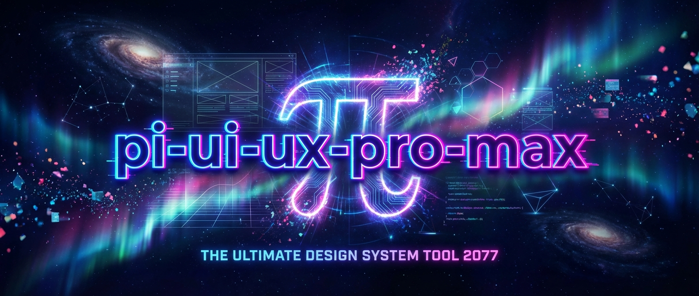

<p align="center">
  
</p>

# pi-ui-ux-pro-max

UI/UX design intelligence for [pi](https://github.com/mariozechner/pi-coding-agent) — 67 styles, 97 color palettes, 57 font pairings, 100 reasoning rules, 24 landing patterns, and 13 tech stack guideline sets, all accessible through typed custom tools.

## Credits & Attribution

This project is a **TypeScript port and architectural reimagining** of [**ui-ux-pro-max-skill**](https://github.com/nicholasgriffintn/ui-ux-pro-max-skill) by [nextlevelbuilder](https://github.com/nextlevelbuilder). The original is a Claude Code skill that provides curated UI/UX intelligence through a Python CLI and CSV data files.

**What we ported:**
- All 476KB of curated CSV data (styles, colors, typography, charts, landing patterns, product types, UX guidelines, icons, reasoning rules, and 13 tech stack guideline sets)
- The BM25 search engine (`core.py` → `src/bm25.ts`)
- The multi-domain search and reasoning logic
- The design system generation pipeline

**What we changed:**
- Rewrote the entire runtime from Python to TypeScript — no external dependencies
- Replaced the ~2,000-token SKILL.md with typed pi tools (~180 words in system prompt)
- Added content/details split — compact results for the LLM (~400 bytes), rich TUI rendering for users
- Added iterative collaboration — the LLM refines queries conversationally instead of one-shot generation
- Added context pruning — old design system iterations are automatically replaced with stubs
- Added persistence — generates `MASTER.md` and page-specific override files
- Added TUI renderers with compact and expanded views for all 3 tools

The CSV data files are MIT-licensed per the [original repository](https://github.com/nicholasgriffintn/ui-ux-pro-max-skill).

---

## What It Does

pi-ui-ux-pro-max gives your AI coding assistant deep knowledge about UI/UX design. Instead of generic advice, the LLM searches curated datasets to make specific, data-driven recommendations — the right color palette for a fintech app, the right font pairing for a wellness brand, the right landing page pattern for a SaaS product.

**Three tools, zero configuration:**

| Tool | Purpose | Data |
|------|---------|------|
| `design_system` | Generate a complete design system recommendation | Searches across styles, colors, typography, patterns, reasoning rules |
| `ui_search` | Search the knowledge base by domain | 10 domains: style, color, typography, chart, landing, product, ux, icons, react, web |
| `ui_stack_guide` | Get stack-specific implementation guidelines | 13 stacks: React, Next.js, Vue, Svelte, Astro, Flutter, SwiftUI, and more |

**Plus:**
- `/ui-checklist` — Pre-delivery UI/UX checklist prompt template
- `/ui-settings` — Configure defaults (stack, auto-inject, format)
- Context pruning — keeps conversations lean during iterative design
- Auto-inject hook — optionally inject active design system into every turn

## Installation

```bash
# From npm (once published)
pi install npm:pi-ui-ux-pro-max

# From git
pi install git:github.com/your-org/pi-ui-ux-pro-max

# Local development
pi -e ./extensions/index.ts
```

Once installed, the tools are available in every pi session. No setup, no Python, no configuration required.

## Quick Start

### Generate a Design System

Just describe what you're building:

```
You: I'm building a wellness spa booking app. Can you create a design system?

pi: [calls design_system with query "wellness spa booking app"]

  ✓ Serenity Spa (Beauty/Spa Service)
    Style: Soft UI Evolution | Pattern: Hero-Centric + Social Proof
    Colors: #E8B4B8 #A8D5BA #D4AF37
    Typography: Cormorant Garamond / Montserrat
```

Don't like the colors? Just say so:

```
You: The colors feel too muted. Can we try something more vibrant?

pi: [calls design_system again with refined query]
```

The tool is designed for iteration — call it as many times as you need. Old results are automatically pruned from context to keep the conversation lean.

### Save to Disk

When you're happy with the design system:

```
You: Perfect. Save this and generate a landing page override.

pi: [calls design_system with persist=true, page="landing"]
  💾 design-system/serenity-spa/MASTER.md
  💾 design-system/serenity-spa/pages/landing.md
```

### Search the Knowledge Base

```
You: What are the best practices for chart accessibility?

pi: [calls ui_search with query "chart accessibility"]
  ✓ ux (3 results)
    • color-blind-safe (CRITICAL)
    • aria-labels-charts (HIGH)
    • reduced-motion (MEDIUM)
```

### Get Stack-Specific Guidance

```
You: How should I handle responsive images in Next.js?

pi: [calls ui_stack_guide with query "responsive images", stack "nextjs"]
  ✓ nextjs (2 results)
    • image-optimization (HIGH)
    • layout-component (HIGH)
```

Press `Ctrl+O` to expand any tool result and see the full details — code examples, do/don't patterns, documentation links, and more.

## Commands

### `/ui-checklist`

Pre-delivery UI/UX checklist. Asks the LLM to review your code against best practices:

- Visual quality (no emoji icons, consistent icon set, hover states)
- Interaction (cursor-pointer, transitions, focus states)
- Contrast & color (4.5:1 ratio, light mode compatibility)
- Layout (responsive, no horizontal scroll, no hidden content)
- Accessibility (alt text, labels, reduced motion)

### `/ui-settings`

View and configure extension settings:

- **Auto-inject design system** — When ON, the active design system summary is injected into every turn (~100 bytes). Default: OFF.
- **Default stack** — Pre-selects a tech stack for `ui_stack_guide` so you don't have to specify it every time. Default: none.
- **Default output format** — Reserved for future use. Default: markdown.

Settings are persisted to `.pi/ui-ux-pro-max.json`.

## Context Efficiency

One of the key improvements over the original skill:

| What | Original Skill | pi-ui-ux-pro-max |
|------|---------------|-----------------|
| System prompt cost | ~2,000 tokens (full SKILL.md) | ~180 words (tool descriptions only) |
| Per-result cost | Full stdout text | ~400 bytes (compact content) |
| 4 design iterations | ~6,400 bytes | ~520 bytes (latest + 3 stubs) |
| Rich data for user | Not available | Full details via TUI expand (zero context cost) |

### How It Works

Every tool returns two things:
- **`content`** — A compact summary sent to the LLM (~300-500 bytes). Enough to reason about.
- **`details`** — Full data for TUI rendering. Never enters the LLM context. Users see it via `Ctrl+O`.

The `context` event hook automatically replaces older design system iterations with stubs, keeping only the latest result in full.

## Supported Tech Stacks

| Stack | File |
|-------|------|
| HTML + Tailwind | `data/stacks/html-tailwind.csv` |
| React | `data/stacks/react.csv` |
| Next.js | `data/stacks/nextjs.csv` |
| Vue | `data/stacks/vue.csv` |
| Nuxt.js | `data/stacks/nuxtjs.csv` |
| Nuxt UI | `data/stacks/nuxt-ui.csv` |
| Svelte | `data/stacks/svelte.csv` |
| Astro | `data/stacks/astro.csv` |
| SwiftUI | `data/stacks/swiftui.csv` |
| React Native | `data/stacks/react-native.csv` |
| Flutter | `data/stacks/flutter.csv` |
| shadcn/ui | `data/stacks/shadcn.csv` |
| Jetpack Compose | `data/stacks/jetpack-compose.csv` |

## Searchable Domains

| Domain | Records | What's In It |
|--------|---------|-------------|
| `style` | 67 | UI style definitions with keywords, colors, effects, framework compatibility |
| `color` | 97 | Color palettes by product type with hex values and usage notes |
| `typography` | 57 | Font pairings with mood, Google Fonts URLs, CSS imports |
| `chart` | 25 | Chart type recommendations by data type |
| `landing` | 24 | Landing page patterns with section order, CTA strategy |
| `product` | 100 | Product type → style/pattern/color mappings |
| `ux` | 99 | UX best practices with Do/Don't and code examples |
| `icons` | ~50 | Icon recommendations by category with import code |
| `react` | ~30 | React-specific performance guidelines |
| `web` | ~30 | Web accessibility and interface guidelines |

## Project Structure

```
pi-ui-ux-pro-max/
├── README.md                  # This file
├── LICENSE                    # MIT License
├── CHANGELOG.md               # Version history
├── package.json               # Pi package manifest
├── tsconfig.json              # TypeScript configuration
├── extensions/
│   └── index.ts               # Extension entry — registers tools, commands, hooks
├── src/
│   ├── bm25.ts                # BM25 search engine (ported from Python)
│   ├── csv-loader.ts          # CSV parsing and indexing
│   ├── design-system.ts       # Design system generator with reasoning engine
│   ├── search.ts              # Domain + stack search functions
│   ├── persist.ts             # MASTER.md + page override generation
│   ├── settings.ts            # Settings management
│   ├── types.ts               # Shared type definitions
│   └── render/
│       ├── design-system.ts   # TUI renderer for design_system tool
│       ├── search.ts          # TUI renderer for ui_search tool
│       └── stack.ts           # TUI renderer for ui_stack_guide tool
├── data/                      # 476KB of curated CSV data
│   ├── styles.csv
│   ├── colors.csv
│   ├── typography.csv
│   ├── charts.csv
│   ├── landing.csv
│   ├── products.csv
│   ├── ui-reasoning.csv
│   ├── ux-guidelines.csv
│   ├── icons.csv
│   ├── react-performance.csv
│   ├── web-interface.csv
│   └── stacks/               # 13 tech stack guideline files
├── prompts/
│   └── ui-checklist.md        # /ui-checklist prompt template
└── docs/
    ├── ARCHITECTURE.md        # Technical architecture deep-dive
    ├── API.md                 # Tool, command, and hook reference
    ├── DATA.md                # Data dictionary for all CSV files
    ├── CONTRIBUTING.md        # Contributor guide
    └── plans/                 # Implementation plans and spec
```

## Development

```bash
# Install dependencies
npm install

# Run tests
npm test

# Run tests in watch mode
npm run test:watch

# Load extension locally
pi -e ./extensions/index.ts
```

### Test Suite

89 tests across 11 test files:

| File | Tests | What It Covers |
|------|-------|---------------|
| `bm25.test.ts` | 6 | Tokenization, IDF, scoring, ranking |
| `csv-loader.test.ts` | 7 | CSV parsing, quoted fields, domain/stack loading |
| `types.test.ts` | 13 | Type definitions, config completeness |
| `search.test.ts` | 11 | Domain search, stack search, auto-detection |
| `design-system.test.ts` | 5 | Generation, reasoning rules, multi-domain search |
| `persist.test.ts` | 4 | MASTER.md generation, page overrides, path sanitization |
| `settings.test.ts` | 4 | Load/save settings, defaults |
| `render/design-system.test.ts` | 14 | All render states (partial, error, compact, expanded) |
| `render/search.test.ts` | 11 | Search renderer states |
| `render/stack.test.ts` | 10 | Stack renderer states |
| `integration.test.ts` | 4 | End-to-end workflow, all domains, all stacks, context size |

## Documentation

- **[Architecture](docs/ARCHITECTURE.md)** — How the system works, design decisions, data flow
- **[API Reference](docs/API.md)** — Detailed reference for all tools, commands, and hooks
- **[Data Dictionary](docs/DATA.md)** — Schema and contents of all CSV data files
- **[Contributing](docs/CONTRIBUTING.md)** — How to add data, write tests, extend the package
- **[Spec & Roadmap](docs/plans/2026-02-09-pi-ui-ux-pro-max-spec.md)** — Original project specification

## License

MIT — see [LICENSE](LICENSE).

The curated CSV data files are derived from [ui-ux-pro-max-skill](https://github.com/nicholasgriffintn/ui-ux-pro-max-skill), also MIT-licensed.
